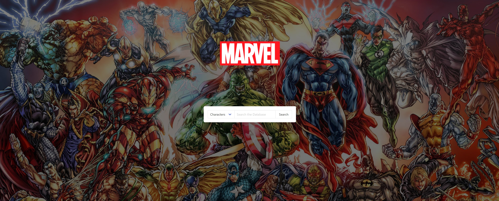

<h1 align="center">Maximum Marvel</h1>

<h2 align="center">
Maximum Marvel is a site built to with the intention to provide a quick and easy way to search the Marvel API while simultaneously retrieving relevant videos from YouTube. In its final form, Maxium Marvel would serve as a tool to allow fans of the Marvel Universe to quickly find out more about their favorite characters, movies, series or even comic books. The inclusion of the YouTube API expands the functionality of the search, providing additional related content.
</h2>
<h3 align="center">
A portion of the code used in this project is from the Bulma.IO framework.
 

 </h3>
<h3 align="center">Special Thanks to the contributors involvled with this project:
 
Jeffrey Ackerman
 
Alec Summers
 
Eden Lewis
 
Apoline Bashale
 
</h3>

